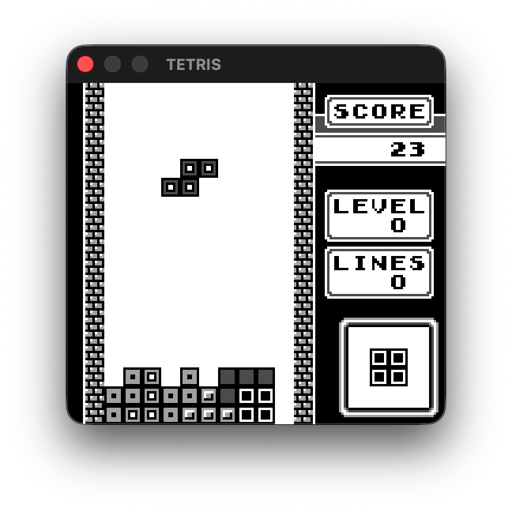
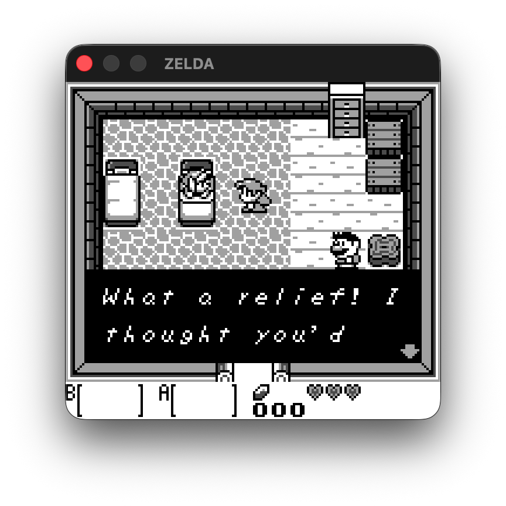
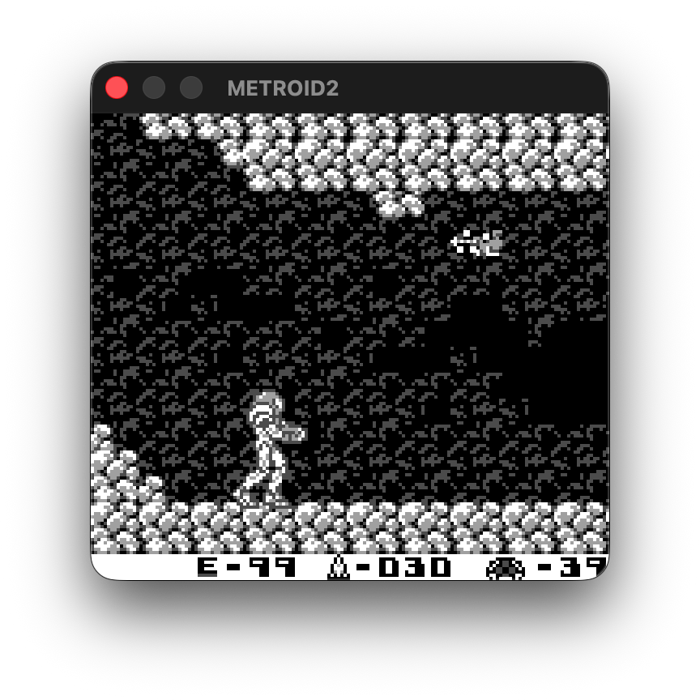
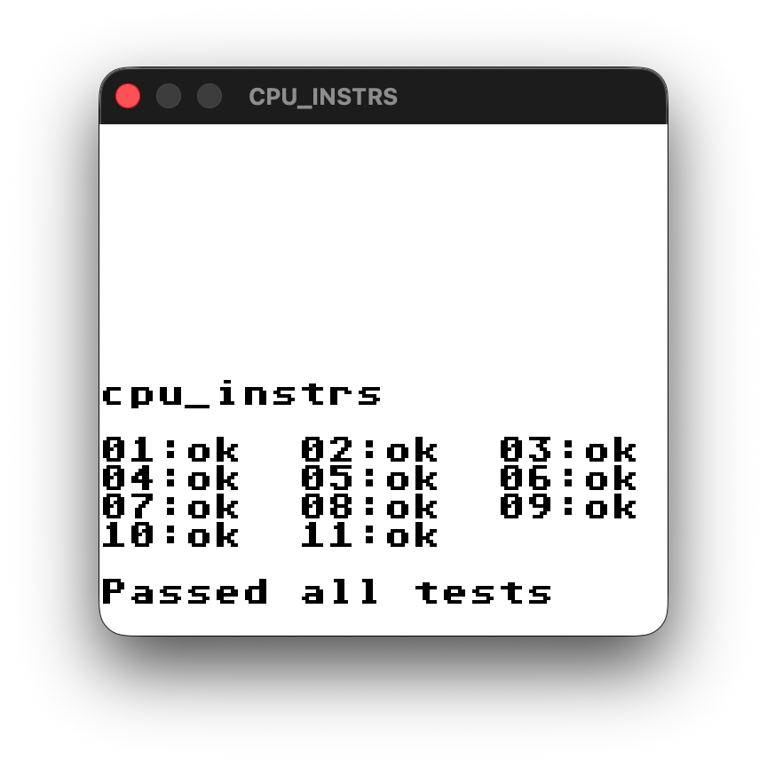

# dot-matrix-rs

This is a complete rewrite of my Game Boy emulator, [Dot Matrix](https://github.com/aminoa/dot-matrix), into Rust. This emulator was built to help me learn rust as well as get a better understanding of the Game Boy hardware.

## Showcase

| Screenshots | |
| --- | --- |
|  |  |
|  |  |
|  |  |

## Implementation Differences from dot-matrix (C++)

- Timing (both the clock and timers) is properly emulated
- PPU background rendering is more accurate and window/object rendering has been added
- Joypad inputs
- Memory banking
- Savestates (F1/F2)

## Out of Scope:

- Pixel FIFO
- APU

## Credits:

- [GB Opcodes Table](https://gbdev.io/gb-opcodes/optables/)
- [The Gameboy Emulator (Graphics) Development Guide](https://hacktix.github.io/GBEDG/ppu/#the-concept-of-scanlines)
- [codeslinger - Emulating the Gameboy](http://www.codeslinger.co.uk/pages/projects/gameboy/)
- [Pan Docs](https://gbdev.io/pandocs/)
- [Nintendo Game Boy Color Palette](https://www.color-hex.com/color-palette/45299)
- [Dot Matrix](https://github.com/aminoa/dot-matrix/)
- [The Ultimate Game Boy Talk (33c3)](https://www.youtube.com/watch?v=HyzD8pNlpwI)
- [Reddit: Gameboy - Confusion over T and M cycle stepping through the CPU and the PPU etc](https://www.reddit.com/r/EmuDev/comments/tnh41p/gameboy_confusion_over_t_and_m_cycle_stepping/)
